# DataMining_GroupProject_Group2
Apply the full data pipeline from ETL → Data Mining → Insights &amp; Storytelling to a chosen dataset or the previously cleaned data. Use mining techniques to uncover patterns, trends, and insights that can  inform decision-making.

# TEAM MEMBERS & Contributions
- Mitchel_413 - Responsible for the Data Mining
- Queen_897 - Responsible for Data Cleaning and Enrichment.
- Claire_470 - Responsible for Insight dashboard and Presentation deck.
- Kyra_619 - Responsible for data mining
- Esther_399 -  Responsible for EDA & dashboard visualizations.
- Julie_996 -  Responsible for EDA & dashboard visualizations.

# Data Cleaning and Enrichment (By Queen)
This script processes finance_dataset.csv by cleaning (handling missing values, standardizing formats, removing outliers) and enriching with calculated fields (Profit_Margin, Revenue_Growth).

# Loaded Original data Results


# Data Cleaning 
Cleaning: Handles missing values, standardizes Date, removes outliers (e.g., Revenue_Millions 72517.50).

# Results for clean Data


# Extraction


## Transformation
# Data Enrichment
Enrichment: Adds Profit_Margin and Revenue_Growth.


# Results for enriching data


# Load Data


Output File: The script produces cleaned_finance_dataset.csv in data/processed/, which includes:

Columns (9): Date (datetime), Company (string), Stock_Price (float), Revenue_Millions (float, outlier removed), Net_Income_Millions (float), Market_Cap_Billions (float), EPS (float), Profit_Margin (float), Revenue_Growth (float).
Rows: 164 (after removing the outlier).
## Tools used
**Pandas**:For data manipulation, used to:
Load and process finance_dataset.csv.
Handle missing values (e.g., filling numeric columns with median, Company with ‘Unknown’).
Standardize the Date column to datetime.
Perform calculations for Profit_Margin and Revenue_Growth.
**NumPy**:For numerical operations

# Exploratory & Statistical Analysis (By Julie & Esther)

This section focuses on exploring and statistically analyzing the dataset to uncover meaningful patterns, trends, and differences across companies based on their financial indicators.

---

## Tools Used
- **Pandas**: For data manipulation and grouping.
- **Seaborn & Matplotlib**: For data visualization (boxplots, barplots, correlation heatmaps).
- **SciPy Stats**: For statistical hypothesis testing (ANOVA and t-tests).
- **NumPy**: For numerical operations.
- **itertools**: For efficient pairwise testing combinations.

---

##  1. Distribution Analysis
- **Objective**: Understand the distribution shapes of key financial variables.
- **Approach**:
  - Plotted histograms for variables like `Revenue_Growth`, `EPS`, and `Stock_Price`.
  - Interpreted symmetry, spread, and outliers.
- **Findings**:
  - `EPS` and `Stock_Price` are approximately normal.
  - `Revenue_Growth` has both positive and negative values, indicating company-level performance shifts.

---

##  2. Categorical Feature Frequency
- **Objective**: Examine how data is distributed across companies and time periods.
- **Approach**:
  - Created countplots for `Company` and `Date`.
- **Findings**:
  - All five companies are equally represented.
  - More entries are concentrated in recent years.

---

##  3. Correlation Matrix
- **Objective**: Identify linear relationships between numerical variables.
- **Approach**:
  - Calculated correlation matrix and visualized it using a heatmap.
- **Key Insights**:
  - `Stock_Price` is highly correlated with `Market_Cap_Billions`, `EPS`, and `Net_Income_Millions`.
  - `Profit_Margin` shows positive relationships with both `EPS` and `Net_Income_Millions`.
  - `Revenue_Growth` has weak correlations with other variables.

---

##  4. Group Comparisons (Company-Level)
###  Boxplot Visualization
- Compared `Net_Income_Millions` across companies using boxplots.
- Observed variations in medians and spreads among different companies.

###  ANOVA Test
- **Objective**: Test whether mean `Net_Income_Millions` significantly differs between companies.
- **Result**:
  - F-statistic: **498.32**, P-value: **< 0.0001**
  - Strong evidence of differences in net income across companies.

###  Pairwise T-tests
- **Objective**: Identify which company pairs differ significantly.
- **Method**: Performed Welch’s t-tests for all pairs (unequal variance).
- **Results**:
  - All company pairs showed statistically significant differences (p < 0.01).
  - `TechCorp` and `FinServ` had significantly higher incomes compared to others.
  - `RetailCo` sits in the middle.

---

##  Summary of My Contributions
- Visualized distribution of numerical and categorical variables.
- Analyzed inter-variable relationships using correlation heatmaps.
- Conducted group-level analysis using ANOVA and pairwise t-tests.
- Interpreted statistical results to draw company-level performance insights.

## Data Mining Techniques(By Mitchel and Kyra)
File name : notebooks/`3-data_mining.ipynb`
**Clustering with K-Means**
- The codes loads the cleaned finance dataset and selects only numeric columns.
- It standardizes these features so they have a mean of 0 and standard deviation of 1.
- The "elbow method " is used to help choose the best number of clusters by plotting inertia for different values of k.
- K-Means clustering is then applied(k=3) and each record is assigned to a cluster.
- Finally, a scatter plot visualizes the clusters using the first two features.
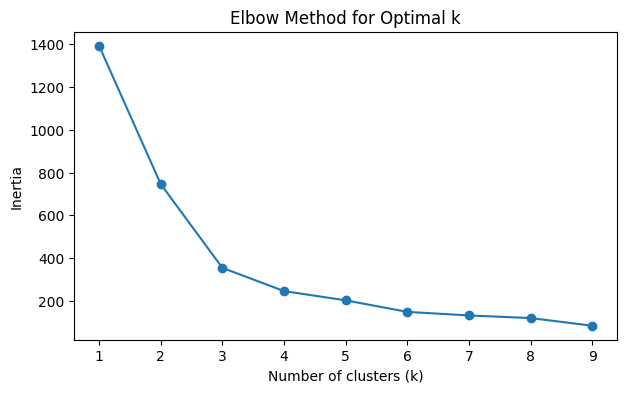
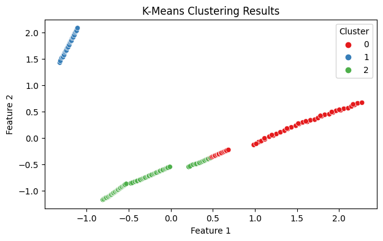

**Anomaly Detection with Isolation Forest**
- The code uses the same numeric features from the dataset.
- It fits an Isolation Forest model, which is designed to detect outliers or anomalies in the data.
- The results are visualized in a scatter plot, with normal points in blue and anomalies in red.
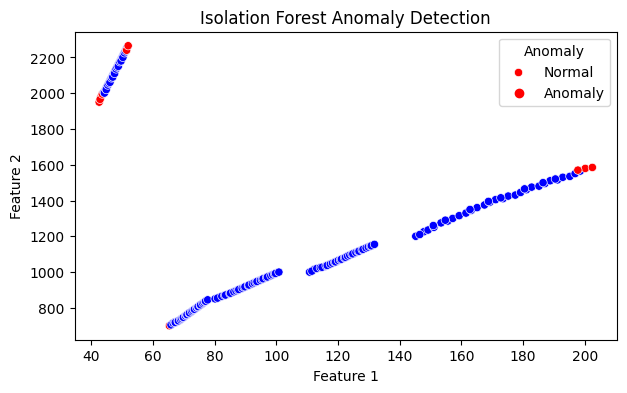

**Classification and Decision Tree Analysis**
- First, create a target column for classification.

- This code block demonstrates how to train and evaluate a Decision Tree classifier to predict whether a company in the finance dataset is considered "High Performance."
```
# Train and evaluate Decision Tree classifier
from sklearn.model_selection import train_test_split
from sklearn.tree import DecisionTreeClassifier, plot_tree
from sklearn.metrics import classification_report, confusion_matrix

features = ['Stock_Price', 'Revenue_Millions', 'Net_Income_Millions',
            'Market_Cap_Billions', 'EPS', 'Profit_Margin', 'Revenue_Growth']
X_cls = df[features]
y_cls = df['High_Performance']

X_train, X_test, y_train, y_test = train_test_split(X_cls, y_cls, test_size=0.2, random_state=50)

clf = DecisionTreeClassifier(random_state=50)
clf.fit(X_train, y_train)

y_pred = clf.predict(X_test)

print("Confusion Matrix:")
print(confusion_matrix(y_test, y_pred))

print("\nClassification Report:")
print(classification_report(y_test, y_pred))
```
- First, it imports the necessary libraries for model training, evaluation, and visualization.
-  The `features` list specifies which columns from the dataset will be used as input variables (such as stock price, revenue, net income, market cap, EPS, profit margin, and revenue growth).
- The target variable, `y_cls`, is the 'High_Performance' column, which likely indicates whether a company meets a certain performance threshold.
- The data is split into training and testing sets using `train_test_split`, with 20% of the data reserved for testing.
- Finally, the code prints out a confusion matrix and a classification report. 
- The confusion matrix shows how many predictions were correct or incorrect for each class, while the classification report provides metrics such as precision, recall, f1-score, and accuracy, giving a detailed summary of the model's performance.

# Dashboard, Insights, and Executive Summary (by Claire)

## Dashboard
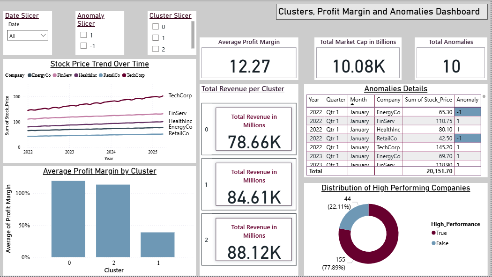
The `Date` column in the `with_clusters_anomalies_and_labels.csv` dataset was converted to proper `datetime` format and saved as a new file: `data_for_powerbi.csv`.

This file was then loaded into Power BI, and column types were refined in the Power Query Editor to enhance compatibility and visualization accuracy:
- `Cluster` and `Anomaly` columns were changed from numerical to categorical (text), allowing for appropriate slicer filtering and chart segmentation.

### Visualizations Created in `presentation.pbix`

1. **Line Chart – Stock Price Over Time**  
   *Objective:* Display company-level performance trends across time.  
   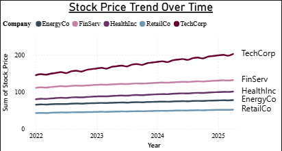

2. **Donut Chart – High vs Low Performing Companies**  
   *Objective:* Visualize the proportion of high-performing companies based on calculated classification.  
   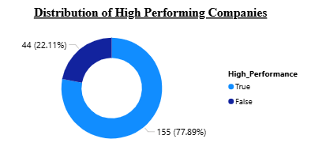

3. **Bar Chart – Average Profit Margin by Cluster**  
   *Objective:* Identify clusters with superior profitability metrics.  
   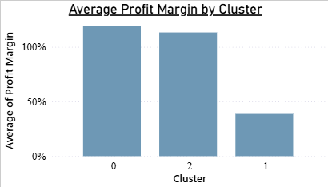

4. **Table – Anomalies Detail View**  
   *Objective:* Provide detailed view of companies flagged as anomalous during specific time periods.  
   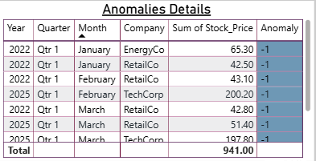

5. **Slicers – Anomaly, Cluster, and Date Filters**  
   *Objective:* Allow interactive filtering and comparative analysis across clusters and time frames.  
   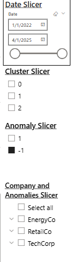

6. **Cards – Summary Metrics**  
   - *Average Profit Margin*  
   - *Total Market Capitalization in Billions*  
   - *Total Anomalies Detected*  
   *Objective:* Offer at-a-glance statistics on key metrics.  
   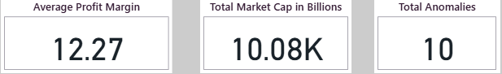  
   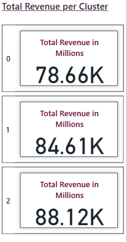

---

## Executive Summary

This project applied a full data science pipeline—from data cleaning to modeling and dashboard storytelling—to evaluate company performance, detect anomalies, and cluster similar entities for strategic insight.

### Project Objective
To uncover hidden patterns and anomalies in company performance over time, enabling insights for investment strategy, risk analysis, and business segmentation.

### Dataset Overview
The dataset includes multi-year financial data for companies, capturing features like stock price, revenue, profit margin, and market capitalization.

### ETL and Data Preparation
- Loading and cleaning the dataset in Python (Pandas).
- Handling missing values and normalizing features like revenue and stock price.
- Transforming the data by adding Profit_Margin and Revenue_Growth.


### Exploratory Data Analysis (EDA)
- Examined how data is distributed across companies and time periods using count plots for `Company` and `Date`.
- Understood the distribution shapes of key financial variables using boxplots and histograms to visualize revenue and profit variations.
- Tested whether mean `Net_Income_Millions` significantly differs between companies using the ANOVA test.
- Identified which company pairs differ significantly using Welch’s t-tests for all pairs (unequal variance).


### Feature Engineering
- New features were constructed to support advanced analysis:
  - Profit Margin Classification (e.g., high vs. low performing).
  - Cluster Labels (from K-means clustering).
  - Anomaly Labels using Isolation Forest algorithm.
  - Aggregated values per cluster: average profit margin, total revenue, etc


### Modeling Insights
- Cluster 0 and Cluster 2 showed higher average profit margins.
- Most anomalies occurred in early 2022, largely among underperforming companies.
- Some low-margin clusters still contributed significantly to total revenue.

### Key Visual Insights from Power BI
- TechCorp consistently leads in stock performance over time
- 22% of companies are high-performing
- Cluster 2 combines high profitability with strong market presence
- Revenue and profit metrics vary significantly across clusters

### Business Implications
- Enables investor decision-making based on clusters and performance trends.
- Supports anomaly monitoring for early risk detection.
- Guides strategic focus towards high-performing segments or clusters.

The complete summary has been included in `executive_summary.pdf`.

---

## Insights and Supporting Code

Three actionable insights were generated using the final cleaned dataset and are supported by code in the `4_insights_dashboard.ipynb` notebook.

```python
# 1. Average Profit Margin by Cluster
cluster_pm = df.groupby("Cluster")["Profit_Margin"].mean().sort_values(ascending=False)
print(cluster_pm)

# 2. High Performance Company Trends
high_perf = df[df["High_Performance"]]
print(high_perf.groupby("Company")["Stock_Price"].mean().sort_values(ascending=False).head())

# 3. Anomalies Detected
anomalies = df[df["Anomaly"] == -1]
print(f"Number of anomalies detected: {len(anomalies)}")
print(anomalies[["Date", "Company", "Stock_Price", "Profit_Margin"]])
```

- Output generated:

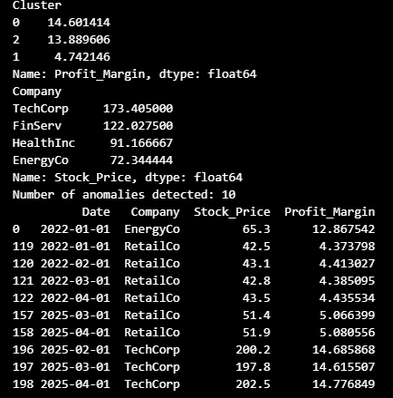

- Key insights from code:
  - Cluster 0 and 2 showed higher average profit margins.
  - Anomalies were mostly in lower-performing companies or during early 2022.

## Key Visual Insights (from Power BI Dashboard)

Based on the Power BI dashboard, we extracted the following insights:
1.	TechCorp consistently leads in stock price growth over time, suggesting sustained performance and investment attractiveness.
2.	Cluster 2 companies have high profit margins, making them ideal for profit-driven investment strategies.
3.	A total of 10 anomalies were detected, many during Q1 2022, signaling possible market disruptions or outlier behavior.
4.	High Performing Companies make up ~22% of the dataset, providing a strong focus segment for deeper portfolio analysis.
5.	Revenue per Cluster shows that even lower-margin clusters (e.g., Cluster 1) can contribute significantly in absolute revenue—relevant for volume-based business models.


